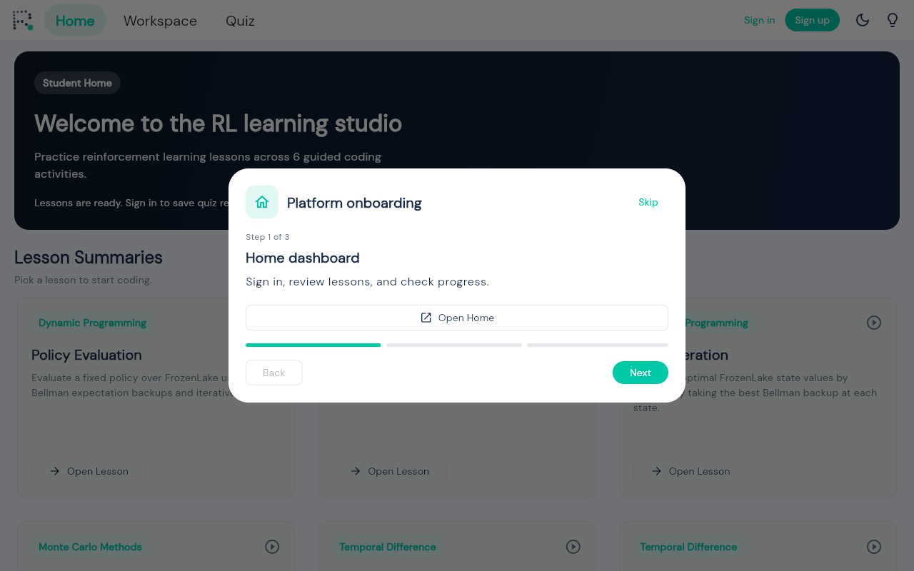

# Reinfource Landing Page

This directory contains the standalone HTML/CSS/JS landing page for `reinfource.app`.

## Auth Redirect Logic
The `index.html` file includes an inline `<script>` in the `<head>` that checks for an authentication cookie (`reinfource_session`). If the cookie exists, it automatically redirects the user to `/app` (the main Flutter application).

*Note: Update the cookie name and redirect route in `index.html` to match the platform's exact production auth architecture before deploying.*

## Integrating Screenshots
Currently, the landing page uses CSS-based glassmorphism "skeletons" as placeholders for the actual platform screenshots. Once you have the screenshots, follow these steps to integrate them:

1. **Add Images to Assets**: Place the screenshots (e.g., `hero.png`, `workspace.png`, `trace.png`, `studybuddy.png`) into the `assets/` folder.
2. **Remove Skeletons**: In `index.html`, locate the elements with the `.glass-placeholder` class.
3. **Insert Image Tags**: Replace the entire `<div class="glass-placeholder ...">` block with a standard `` tag pointing to the new asset.
   
   **Example Replacement for Hero Image:**
   ```html
   <!-- REMOVE THIS BLOCK: -->
   <div class="hero-image">
     <div class="glass-placeholder hero-glass">...</div>
   </div>
   
   <!-- REPLACE WITH THIS: -->
   <div class="hero-image">
     
   </div>
   ```
4. **Style the Images**: In `style.css`, add styling for your new image classes (e.g., `.hero-mockup-img`) to give them rounded corners (`border-radius: 12px;`), shadows, and ensure they are responsive (`width: 100%; height: auto;`).

## Local Development
To preview the landing page locally:
```bash
npx serve .
```
